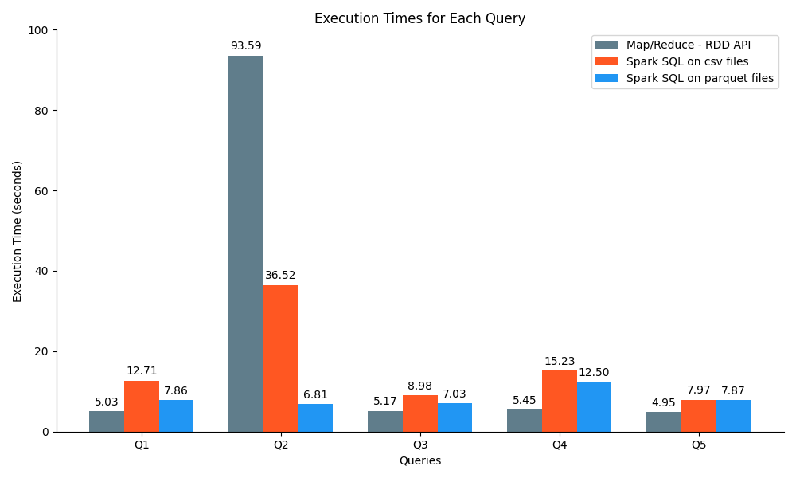

# DSIT Big Data Management Project

This is the final project for the Big Data Management course of the Data Science and Information Technologies MSc
program at the University of Athens.

## Project Description

The project description can be found [here](Project.pdf)

## Dataset Overview

#### movies.csv

| movie_id | name            | description                     | release_year | duration | production_cost | revenue | popularity |
| -------- | --------------- | ------------------------------- | ------------ | -------- | --------------- | ------- | ---------- |
| 1        | The Great Gatsby| A tale of wealth and decadence   | 2013         | 143      | 105000000       | 353600000| 7.3        |

#### ratings.csv

| user_id | movie_id | rating | timestamp           |
| ------- | -------- | ------ | ------------------- |
| 1       | 1        | 4.5    | 2023-06-29 10:15:00 |

#### movie_genres.csv

| movie_id | genre  |
| -------- | ------ |
| 1        | Drama  |

## Solution

### CSV to Parquet

### Part 1

#### Task 1

```bash
wget https://www.dropbox.com/s/c10t67glk60wpha/datasets2023.tar.gz?dl=0
mv datasets2023.tar.gz?dl=0 datasets.tar.gz
tar -xzf datasets.tar.gz
hadoop fs -mkdir files
hadoop fs -copyFromLocal * files
hadoop fs -ls
```

#### Task 2

- [Q1](solution/part1/task2/q1.py)
  ```bash
  ('Execution Time', 5.033608913421631)
  Top 10 Movies in terms of profit:
  (19995, u'Avatar', 2009, 2550965087)
  (140607, u'Star Wars: The Force Awakens', 2015, 1823223624)
  (597, u'Titanic', 1997, 1645034188)
  (135397, u'Jurassic World', 2015, 1363528810)
  (168259, u'Furious 7', 2015, 1316249360)
  (24428, u'The Avengers', 2012, 1299557910)
  (12445, u'Harry Potter and the Deathly Hallows: Part 2', 2011, 1217000000)
  (99861, u'Avengers: Age of Ultron', 2015, 1125403694)
  (109445, u'Frozen', 2013, 1124219009)
  (321612, u'Beauty and the Beast', 2017, 1102886337)
  ```
- [Q2](solution/part1/task2/q2.py)
  ```bash
  ('Execution Time', 93.59469318389893)
  ("Movie ID for 'Cesare deve morire':", 96821)
  ("Number of ratings for 'Cesare deve morire':", 5096)
  ("Average rating for 'Cesare deve morire':", 3.8701923076923084)
  ```
- [Q3](solution/part1/task2/q3.py)
  ```bash
  ('Execution Time', 5.174684047698975)
  ('Best Animation Movie of 1995 in terms of revenue:', u'Toy Story')
  ```
- [Q4](solution/part1/task2/q4.py)
  ```bash
  ('Execution Time', 5.452530860900879)
  Best Comedy Movies by Year:
  (1996, u'Mars Attacks!')
  (1997, u'La vita \xe8 bella')
  (1998, u'Six Days Seven Nights')
  (1999, u'American Pie')
  (2000, u'Coyote Ugly')
  (2001, u'Monsters Inc.')
  (2002, u'Ice Age')
  (2003, u'School of Rock')
  (2004, u'Shark Tale')
  (2005, u'Charlie and the Chocolate Factory')
  (2006, u'Bandidas')
  (2007, u'Ratatouille')
  (2008, u'Kung Fu Panda')
  (2009, u'The Hangover')
  (2010, u'Grown Ups')
  (2011, u'The Hangover Part II')
  (2012, u'Ted')
  (2013, u'The Hangover Part III')
  (2014, u'Big Hero 6')
  (2015, u'Minions')
  (2016, u'Deadpool')
  (2017, u'Guardians of the Galaxy Vol. 2')
  ```
- [Q5](solution/part1/task2/q5.py)
  ```bash
  ('Execution Time', 4.947165012359619)
  Average Movie Revenue by Year:
  (1915, 5568682)
  (1916, 8000000)
  (1918, 8000000)
  (1921, 2500000)
  (1922, 400200)
  (1923, 623)
  (1924, 1213880)
  (1925, 5708183)
  (1926, 812439)
  (1927, 559433)
  (1928, 543529)
  (1929, 4358000)
  (1930, 4003970)
  (1931, 3814592)
  (1932, 798512)
  (1933, 4595166)
  (1934, 2347666)
  (1935, 2010366)
  (1936, 3734000)
  (1937, 92539711)
  ...
  ```

#### Task 3

For this task we need to convert the CSV files to Parquet files.

The Python script to convert the CSV files to Parquet files is [here](solution/part1/task3/csv_to_parquet.py).

It can be run as follows:

```bash
spark-submit csv_to_parquet.py
```

- [Q1](solution/part1/task3/q1.py)
  ```bash
  ('Execution Time', 7.862766981124878)
  Top 10 Movies in terms of profit:
  (140607, u'Star Wars: The Force Awakens', 2015, 1823223624)
  (597, u'Titanic', 1997, 1645034188)
  (135397, u'Jurassic World', 2015, 1363528810)
  (168259, u'Furious 7', 2015, 1316249360)
  (24428, u'The Avengers', 2012, 1299557910)
  (12445, u'Harry Potter and the Deathly Hallows: Part 2', 2011, 1217000000)
  (99861, u'Avengers: Age of Ultron', 2015, 1125403694)
  (109445, u'Frozen', 2013, 1124219009)
  (321612, u'Beauty and the Beast', 2017, 1102886337)
  (211672, u'Minions', 2015, 1082730962)
  ```
- [Q2](solution/part1/task3/q2.py)
  ```bash
    ('Execution Time', 6.805627107620239))
    ("Movie ID for 'Cesare deve morire'", 96821)
    ("Number of ratings for 'Cesare deve morire'", 5096)
    ("Average rating for 'Cesare deve morire'", 3.8701923076923075)
  ```
- [Q3](solution/part1/task3/q3.py)
  ```bash
    ('Execution Time', 7.029250144958496)
    ('Best Animation Movie of 1995 in terms of revenue', u'Pocahontas')
  ```
- [Q4](solution/part1/task3/q4.py)
    ```bash
    ('Execution Time', 12.496517181396484)
    Best Comedy Movies by Year:
    (1996, u'Mars Attacks!')
    (1997, u'La vita \xe8 bella')
    (1998, u'Six Days Seven Nights')
    (1999, u'American Pie')
    (2000, u'Coyote Ugly')
    (2001, u'Monsters Inc.')
    (2002, u'Ice Age')
    (2003, u'School of Rock')
    (2004, u'Shark Tale')
    (2005, u'Charlie and the Chocolate Factory')
    (2006, u'Bandidas')
    (2007, u'Ratatouille')
    (2008, u'Kung Fu Panda')
    (2009, u'The Hangover')
    (2010, u'Grown Ups')
    (2011, u'The Hangover Part II')
    (2012, u'Ted')
    (2013, u'The Hangover Part III')
    (2014, u'Big Hero 6')
    (2015, u'Minions')
    (2016, u'Deadpool')
    (2017, u'Guardians of the Galaxy Vol. 2')
    ```
- [Q5](solution/part1/task3/q5.py)
  ```
  ('Execution Time', 7.869164943695068))
  +------------+------------------+
  |release_year|       avg_revenue|
  +------------+------------------+
  |        1915|         5568682.5|
  |        1916|         8000000.0|
  |        1918|         8000000.0|
  |        1921|         2500000.0|
  |        1922|          400200.0|
  |        1923|             623.0|
  |        1924|         1213880.0|
  |        1925|         5708183.5|
  |        1926|          812439.0|
  |        1927| 559433.3333333334|
  |        1928|          543529.6|
  |        1929|         4358000.0|
  |        1930|         4003970.0|
  |        1931|         3814592.5|
  |        1932|          798512.5|
  |        1933| 4595166.666666667|
  |        1934|2347666.6666666665|
  |        1935|         2010366.2|
  |        1936|         3734000.0|
  |        1937|       9.2539711E7|
  +------------+------------------+
  only showing top 20 rows
  ```

#### Task 4



The bar chart presents the execution times of different queries using three distinct data processing approaches:
Map/Reduce - RDD API, Spark SQL on CSV files, and Spark SQL on Parquet files. Each approach offers a unique perspective
on query performance.

When employing the Map/Reduce - RDD API, the execution times remain relatively consistent across the queries. Q2 emerges
as the most time-consuming, requiring approximately 93.59 seconds to complete. Conversely, Q5 showcases impressive
efficiency, concluding in just 4.95 seconds.

In the case of Spark SQL on CSV files, the execution times exhibit more noticeable variations. Notably, Q2 necessitates
the most extensive processing time, clocking in at around 36.52 seconds. On the other hand, Q5 showcases relative
expediency, accomplishing the task in approximately 7.97 seconds.

In contrast, Spark SQL on Parquet files demonstrates a more balanced performance in terms of execution times. Q2
demonstrates exceptional speed, completing in a mere 6.81 seconds. Conversely, Q4 becomes the most time-consuming query,
demanding approximately 12.50 seconds to finalize.

These findings highlight the advantages of employing Spark SQL on Parquet files for improved query performance. This
approach offers swifter execution times for most queries, providing efficient data processing capabilities. However, it
remains crucial to consider specific dataset requirements and characteristics when selecting the most suitable data
processing approach for optimal results.

*The Python script that generates the bar chart can be found [here](solution/part1/task4/plot.py).*

### Part 2
