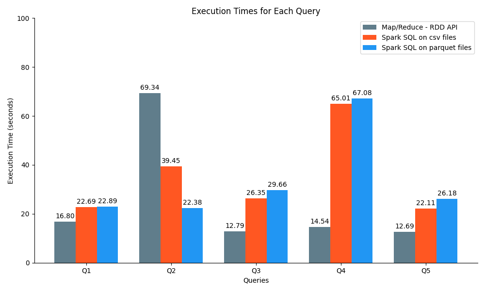
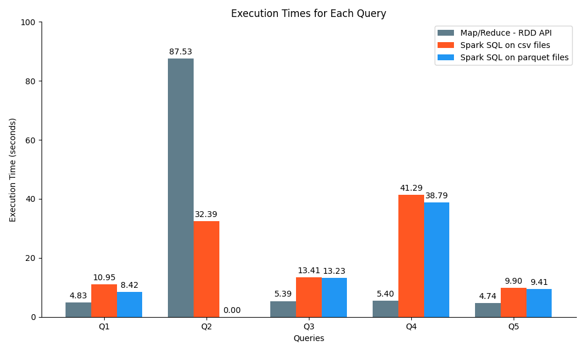
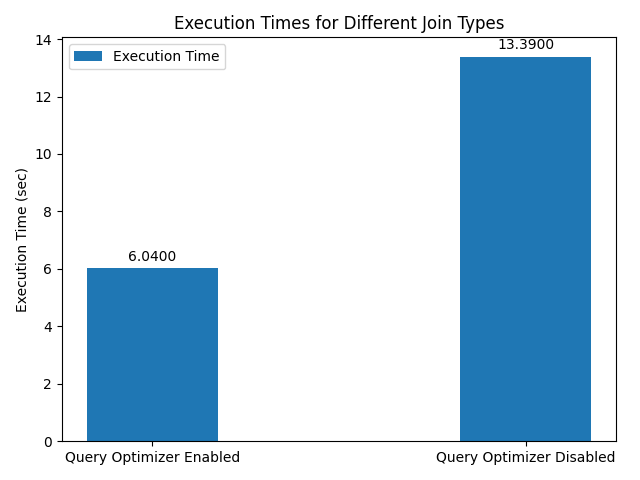

# DSIT Big Data Management Final Project

This repository hosts the final project for the **Data Science and Information Technologies M.Sc.** program at the
**University of Athens**, demonstrating the implementation of **Apache Spark** for managing large datasets. Conducted
during the Spring Semester of the 2022-2023 academic year, the project emphasizes on the following key components:

1. **RDDs and DataFrames:** We employ **Resilient Distributed Datasets (RDDs)** and *DataFrames** to handle a variety of
   query challenges, providing a practical application of these data structures in the realm of big data.

2. **Evaluation of Join Algorithms:** An in-depth evaluation and comparative analysis of various join algorithms are
   conducted, scrutinizing their performance in different scenarios.

For this project, we use a comprehensive movie dataset, which includes movie information, ratings, and genres. Queries
are executed using both the **RDD API** and the **DataFrame/SQL API**, with each instance's execution times carefully
recorded for subsequent analysis.

In this repository, you'll find the source code, the execution outputs, and a thorough report detailing the project's
methodology, execution, and findings. The project offers insights into big data management and the application of Apache
Spark.

The project description can be found [here](Project.pdf)

## Dataset Overview

#### movies.csv

| movie_id | name             | description                    | release_year | duration | production_cost | revenue   | popularity |
|----------|------------------|--------------------------------|--------------|----------|-----------------|-----------|------------|
| 1        | The Great Gatsby | A tale of wealth and decadence | 2013         | 143      | 105000000       | 353600000 | 7.3        |

#### ratings.csv

| user_id | movie_id | rating | timestamp           |
|---------|----------|--------|---------------------|
| 1       | 1        | 4.5    | 2023-06-29 10:15:00 |

#### movie_genres.csv

| movie_id | genre |
|----------|-------|
| 1        | Drama |

#### employeesR.csv

| employee_id | name | department_id |
|-------------|------|---------------|
| 1           | John | 1             |

#### departmentsR.csv

| department_id | department_name |
|---------------|-----------------|
| 1             | HR              |

## Clusters

All the **Spark jobs** were executed and timed in *two different clusters*:

- The cluster provided by the course in **Okeanos**
    - 2 node cluster with 2 cores and 4GB of RAM each
- A local "cluster" with 1 node based on the [**Hortonworks Sandbox
  2.6.5**](https://www.cloudera.com/downloads/hortonworks-sandbox.html)
    - 4 cores and 8GB of RAM

The results found in the [output](output) folder are from the **Hortonworks Sandbox** (with the only difference being
the timings), but detailed timing details (for execution in both clusters) can be found either below or in the timings
section:

- [Spark Execution Times Okeanos](../spark_execution_times_okeanos.json)
- [Spark Execution Times Hortonworks](../spark_execution_times_hortonworks.json)
- [Query Optimizer Execution Times Okeanos](../query_optimizer_execution_times_okeanos.json)

## CSV to Parquet

The Python script to convert the **CSV files** to **Parquet** files is [here](src/csv_to_parquet.py).

It can be run as follows:

```bash
spark-submit csv_to_parquet.py
```

**Note:** _`ratings` couldn't be converted to **Parquet** in the **Hortonworks Sandbox** due to resource limitations,
thus the spark jobs that require it were executed only in the **Okeanos** cluster_

## Solutions

### Part 1: _Task 1_

```bash
wget https://www.dropbox.com/s/c10t67glk60wpha/datasets2023.tar.gz?dl=0
mv datasets2023.tar.gz?dl=0 datasets.tar.gz
tar -xzf datasets.tar.gz
hadoop fs -mkdir files
hadoop fs -copyFromLocal * files
hadoop fs -ls
```

### Part 1: _Task 2_

#### Q1

_For every year after 1995 print the difference between the money spent to create the movie and the revenue of the
movie._

- [Q1 RDD Solution](src/RDD/q1.py)

- [Q1 RDD Raw Output](output/RDD/q1.txt)

<details>
<summary>Q1 Results</summary>

| ID     | Title                                        | Year | Profit            |
|--------|----------------------------------------------|------|-------------------|
| 19995  | Avatar                                       | 2009 | $2,550,965,087.00 |
| 140607 | Star Wars: The Force Awakens                 | 2015 | $1,823,223,624.00 |
| 597    | Titanic                                      | 1997 | $1,645,034,188.00 |
| 135397 | Jurassic World                               | 2015 | $1,363,528,810.00 |
| 168259 | Furious 7                                    | 2015 | $1,316,249,360.00 |
| 24428  | The Avengers                                 | 2012 | $1,299,557,910.00 |
| 12445  | Harry Potter and the Deathly Hallows: Part 2 | 2011 | $1,217,000,000.00 |
| 99861  | Avengers: Age of Ultron                      | 2015 | $1,125,403,694.00 |
| 109445 | Frozen                                       | 2013 | $1,124,219,009.00 |
| 321612 | Beauty and the Beast                         | 2017 | $1,102,886,337.00 |

_Please refer to the [output](output/RDD/q1.txt) for the full list of results._

</details>

#### Q2

_For the movie "Cesare deve morire" find and print the movie's id and then search how many users rated the movie and
what the average rating was._

- [Q2 RDD Solution](src/RDD/q2.py)
- [Q2 RDD Raw Output](output/RDD/q2.txt)

|                                            | Value          |
|--------------------------------------------|----------------|
| Movie ID for "Cesare deve morire"          | 96821          |
| Number of ratings for "Cesare deve morire" | 5096           |
| Average rating for "Cesare deve morire"    | 3.870192307692 |

#### Q3

_What is the best animation movie of 1995 in terms of revenue?_

- [Q3 RDD Solution](src/RDD/q3.py)
- [Q3 RDD Raw Output](output/RDD/q3.txt)

|                                                  | Value     |
|--------------------------------------------------|-----------|
| Best Animation Movie of 1995 in terms of revenue | Toy Story |

#### Q4

_Find and print the most popular Comedy movie for each year after 1995._

- [Q4 RDD Solution](src/RDD/q4.py)
- [Q4 RDD Raw Output](output/RDD/q4.txt)

<details>
<summary>Q4 Results</summary>

| Year | Movie                             | Revenue (in millions) |
|------|-----------------------------------|-----------------------|
| 1996 | Mars Attacks!                     | $15.63                |
| 1997 | La vita è bella                   | $39.39                |
| 1998 | Six Days Seven Nights             | $18.32                |
| 1999 | American Pie                      | $18.34                |
| 2000 | Coyote Ugly                       | $15.65                |
| 2001 | Monsters Inc.                     | $26.42                |
| 2002 | Ice Age                           | $17.33                |
| 2003 | School of Rock                    | $17.95                |
| 2004 | Shark Tale                        | $18.00                |
| 2005 | Charlie and the Chocolate Factory | $22.04                |
| 2006 | Bandidas                          | $19.29                |
| 2007 | Ratatouille                       | $20.51                |
| 2008 | Kung Fu Panda                     | $16.90                |
| 2009 | The Hangover                      | $23.95                |
| 2010 | Grown Ups                         | $23.98                |
| 2011 | The Hangover Part II              | $21.89                |
| 2012 | Ted                               | $19.64                |
| 2013 | The Hangover Part III             | $25.09                |
| 2014 | Big Hero 6                        | $213.85               |
| 2015 | Minions                           | $547.49               |
| 2016 | Deadpool                          | $187.86               |
| 2017 | Guardians of the Galaxy Vol. 2    | $185.33               |

</details>

#### Q5

_For every year print the average movie revenue._

- [Q5 RDD Solution](src/RDD/q5.py)
- [Q5 RDD Raw Output](output/RDD/q5.txt)

<details>
<summary>Q5 Results</summary>

| Year | Average Revenue (in millions) |
|------|-------------------------------|
| 1915 | $5.57                         |
| 1916 | $8.00                         |
| 1918 | $8.00                         |
| 1921 | $2.50                         |
| 1922 | $0.40                         |
| 1923 | $0.00                         |
| 1924 | $1.21                         |
| 1925 | $5.71                         |
| 1926 | $0.81                         |
| 1927 | $0.56                         |
| 1928 | $0.54                         |
| 1929 | $4.36                         |
| 1930 | $4.00                         |
| 1931 | $3.81                         |
| 1932 | $0.80                         |
| 1933 | $4.60                         |
| 1934 | $2.35                         |
| 1935 | $2.01                         |
| 1936 | $3.73                         |
| 1937 | $92.54                        |
| 1938 | $5.14                         |
| 1939 | $74.86                        |
| 1940 | $38.76                        |
| 1941 | $8.78                         |
| 1942 | $50.14                        |
| 1943 | $1.40                         |
| 1944 | $5.53                         |
| 1945 | $9.50                         |
| 1946 | $19.54                        |
| 1947 | $3.97                         |
| 1948 | $2.83                         |
| 1949 | $5.70                         |
| 1950 | $46.47                        |
| 1951 | $64.96                        |
| 1952 | $8.57                         |
| 1953 | $21.01                        |
| 1954 | $9.77                         |
| 1955 | $12.05                        |
| 1956 | $22.03                        |
| 1957 | $7.70                         |
| 1958 | $11.67                        |
| 1959 | $28.38                        |
| 1960 | $15.29                        |
| 1961 | $22.80                        |
| 1962 | $25.64                        |
| 1963 | $23.32                        |
| 1964 | $27.83                        |
| 1965 | $56.09                        |
| 1966 | $12.31                        |
| 1967 | $32.42                        |
| 1968 | $20.39                        |
| 1969 | $24.49                        |
| 1970 | $30.53                        |
| 1971 | $27.63                        |
| 1972 | $40.52                        |
| 1973 | $55.77                        |
| 1974 | $44.91                        |
| 1975 | $42.46                        |
| 1976 | $40.65                        |
| 1977 | $77.03                        |
| 1978 | $37.38                        |
| 1979 | $51.53                        |
| 1980 | $36.25                        |
| 1981 | $32.77                        |
| 1982 | $44.71                        |
| 1983 | $31.63                        |
| 1984 | $38.92                        |
| 1985 | $33.02                        |
| 1986 | $30.52                        |
| 1987 | $31.02                        |
| 1988 | $32.37                        |
| 1989 | $52.78                        |
| 1990 | $55.66                        |
| 1991 | $44.35                        |
| 1992 | $55.69                        |
| 1993 | $52.04                        |
| 1994 | $59.31                        |
| 1995 | $63.70                        |
| 1996 | $61.22                        |
| 1997 | $72.63                        |
| 1998 | $65.41                        |
| 1999 | $76.32                        |
| 2000 | $74.46                        |
| 2001 | $79.85                        |
| 2002 | $77.23                        |
| 2003 | $87.60                        |
| 2004 | $84.53                        |
| 2005 | $71.24                        |
| 2006 | $65.37                        |
| 2007 | $76.37                        |
| 2008 | $77.65                        |
| 2009 | $82.29                        |
| 2010 | $76.62                        |
| 2011 | $77.82                        |
| 2012 | $85.44                        |
| 2013 | $79.13                        |
| 2014 | $82.38                        |
| 2015 | $92.97                        |
| 2016 | $101.99                       |
| 2017 | $153.84                       |

</details>

### Part 1: _Task 3_

All the scripts for this task have an option to run on the CSV files or the Parquet files. To run in parquet mode add
the optional `--parquet` flag. To run in CSV mode add the optional `--csv` flag. If neither flag is provided, the csv
mode is run by default.

_The raw output for all the DF spark jobs is from parquet mode, but timings for both modes are provided in the next
section._

#### Q1

_For every year after 1995 print the difference between the money spent to create the movie and the revenue of the
movie._

- [Q1 DF Solution](src/DF/q1.py)

- [Q1 DF Raw Output](output/DF/q1.txt)

<details>
<summary>Q1 Results</summary>

| ID     | Title                                        | Year | Profit            |
|--------|----------------------------------------------|------|-------------------|
| 19995  | Avatar                                       | 2009 | $2,550,965,087.00 |
| 140607 | Star Wars: The Force Awakens                 | 2015 | $1,823,223,624.00 |
| 597    | Titanic                                      | 1997 | $1,645,034,188.00 |
| 135397 | Jurassic World                               | 2015 | $1,363,528,810.00 |
| 168259 | Furious 7                                    | 2015 | $1,316,249,360.00 |
| 24428  | The Avengers                                 | 2012 | $1,299,557,910.00 |
| 12445  | Harry Potter and the Deathly Hallows: Part 2 | 2011 | $1,217,000,000.00 |
| 99861  | Avengers: Age of Ultron                      | 2015 | $1,125,403,694.00 |
| 109445 | Frozen                                       | 2013 | $1,124,219,009.00 |
| 321612 | Beauty and the Beast                         | 2017 | $1,102,886,337.00 |

_Please refer to the [output](output/DF/q1.txt) for the full list of results._

</details>

#### Q2

_For the movie "Cesare deve morire" find and print the movie's id and then search how many users rated the movie and
what the average rating was._

- [Q2 DF Solution](src/DF/q2.py)
- [Q2 DF Raw Output](output/DF/q2.txt)

Unlike all the other Spark jobs, we weren't able to run this one on the **Hortonworks** cluster (on **Parquet** files)
due to the `ratings` table being too large. It was run on:

- CSV files on the **Hortonworks** cluster
- Parquet files on the **Okeanos** cluster
- CSV files on the **Okeanos** cluster

The raw output is from the **Parquet** files run on the **Okeanos** cluster (unlike the other Spark jobs).

|                                            | Value          |
|--------------------------------------------|----------------|
| Movie ID for 'Cesare deve morire'          | 96821          |
| Number of ratings for 'Cesare deve morire' | 5096           |
| Average rating for 'Cesare deve morire'    | 3.870192307692 |

#### Q3

_What is the best animation movie of 1995 in terms of revenue?_

- [Q3 DF Solution](src/DF/q3.py)
- [Q3 DF Raw Output](output/DF/q3.txt)

|                                                  | Value     |
|--------------------------------------------------|-----------|
| Best Animation Movie of 1995 in terms of revenue | Toy Story |

#### Q4

_Find and print the most popular Comedy movie for each year after 1995._

- [Q4 DF Solution](src/DF/q4.py)
- [Q4 DF Raw Output](output/DF/q4.txt)

<details>
<summary>Q4 Results</summary>

| Year | Movie                             | Revenue (in millions) |
|------|-----------------------------------|-----------------------|
| 1996 | Mars Attacks!                     | $15.63                |
| 1997 | La vita è bella                   | $39.39                |
| 1998 | Six Days Seven Nights             | $18.32                |
| 1999 | American Pie                      | $18.34                |
| 2000 | Coyote Ugly                       | $15.65                |
| 2001 | Monsters Inc.                     | $26.42                |
| 2002 | Ice Age                           | $17.33                |
| 2003 | School of Rock                    | $17.95                |
| 2004 | Shark Tale                        | $18.00                |
| 2005 | Charlie and the Chocolate Factory | $22.04                |
| 2006 | Bandidas                          | $19.29                |
| 2007 | Ratatouille                       | $20.51                |
| 2008 | Kung Fu Panda                     | $16.90                |
| 2009 | The Hangover                      | $23.95                |
| 2010 | Grown Ups                         | $23.98                |
| 2011 | The Hangover Part II              | $21.89                |
| 2012 | Ted                               | $19.64                |
| 2013 | The Hangover Part III             | $25.09                |
| 2014 | Big Hero 6                        | $213.85               |
| 2015 | Minions                           | $547.49               |
| 2016 | Deadpool                          | $187.86               |
| 2017 | Guardians of the Galaxy Vol. 2    | $185.33               |

</details>

#### Q5

_For every year print the average movie revenue._

- [Q5 DF Solution](src/DF/q5.py)
- [Q5 DF Raw Output](output/DF/q5.txt)

<details>
<summary>Q5 Results</summary>

| Year | Average Revenue (in millions) |
|------|-------------------------------|
| 1915 | $5.57                         |
| 1916 | $8.00                         |
| 1918 | $8.00                         |
| 1921 | $2.50                         |
| 1922 | $0.40                         |
| 1923 | $0.00                         |
| 1924 | $1.21                         |
| 1925 | $5.71                         |
| 1926 | $0.81                         |
| 1927 | $0.56                         |
| 1928 | $0.54                         |
| 1929 | $4.36                         |
| 1930 | $4.00                         |
| 1931 | $3.81                         |
| 1932 | $0.80                         |
| 1933 | $4.60                         |
| 1934 | $2.35                         |
| 1935 | $2.01                         |
| 1936 | $3.73                         |
| 1937 | $92.54                        |
| 1938 | $5.14                         |
| 1939 | $74.86                        |
| 1940 | $38.76                        |
| 1941 | $8.78                         |
| 1942 | $50.14                        |
| 1943 | $1.40                         |
| 1944 | $5.53                         |
| 1945 | $9.50                         |
| 1946 | $19.54                        |
| 1947 | $3.97                         |
| 1948 | $2.83                         |
| 1949 | $5.70                         |
| 1950 | $46.47                        |
| 1951 | $64.96                        |
| 1952 | $8.57                         |
| 1953 | $21.01                        |
| 1954 | $9.77                         |
| 1955 | $12.05                        |
| 1956 | $22.03                        |
| 1957 | $7.70                         |
| 1958 | $11.67                        |
| 1959 | $28.38                        |
| 1960 | $15.29                        |
| 1961 | $22.80                        |
| 1962 | $25.64                        |
| 1963 | $23.32                        |
| 1964 | $27.83                        |
| 1965 | $56.09                        |
| 1966 | $12.31                        |
| 1967 | $32.42                        |
| 1968 | $20.39                        |
| 1969 | $24.49                        |
| 1970 | $30.53                        |
| 1971 | $27.63                        |
| 1972 | $40.52                        |
| 1973 | $55.77                        |
| 1974 | $44.91                        |
| 1975 | $42.46                        |
| 1976 | $40.65                        |
| 1977 | $77.03                        |
| 1978 | $37.38                        |
| 1979 | $51.53                        |
| 1980 | $36.25                        |
| 1981 | $32.77                        |
| 1982 | $44.71                        |
| 1983 | $31.63                        |
| 1984 | $38.92                        |
| 1985 | $33.02                        |
| 1986 | $30.52                        |
| 1987 | $31.02                        |
| 1988 | $32.37                        |
| 1989 | $52.78                        |
| 1990 | $55.66                        |
| 1991 | $44.35                        |
| 1992 | $55.69                        |
| 1993 | $52.04                        |
| 1994 | $59.31                        |
| 1995 | $63.70                        |
| 1996 | $61.22                        |
| 1997 | $72.63                        |
| 1998 | $65.41                        |
| 1999 | $76.32                        |
| 2000 | $74.46                        |
| 2001 | $79.85                        |
| 2002 | $77.23                        |
| 2003 | $87.60                        |
| 2004 | $84.53                        |
| 2005 | $71.24                        |
| 2006 | $65.37                        |
| 2007 | $76.37                        |
| 2008 | $77.65                        |
| 2009 | $82.29                        |
| 2010 | $76.62                        |
| 2011 | $77.82                        |
| 2012 | $85.44                        |
| 2013 | $79.13                        |
| 2014 | $82.38                        |
| 2015 | $92.97                        |
| 2016 | $101.99                       |
| 2017 | $153.84                       |

</details>

### Part 1: _Task 4_

#### Timings Okeanos Cluster



#### Timings Hortonworks Sandbox



In the **Hortonworks Sandbox**, a *single-node cluster*, the **Map/Reduce - RDD API** has shown superior performance for
most of the queries. The only exception being Q2 where **Spark SQL** on csv files performs significantly better.
Interestingly, the execution time for Q2 in the **Parquet** format was not captured, so we cannot compare this to the
other methods. This suggests that for smaller, single-node clusters, the traditional **Map/Reduce** can still be highly
effective, possibly due to the lack of network overhead present in distributed systems.

Moving to the **Okeanos** cluster, a *distributed 2-node environment*, we see a different picture. Although the
execution times across all methods are generally higher, possibly due to the overhead of data communication between
nodes, there's no one-size-fits-all solution. The best performing method varies depending on the specific query,
suggesting that the optimal strategy may depend on the nature of the task at hand. Interestingly, we see the columnar
format **Parquet** showing competitive times in several queries, hinting at the advantage of columnar storage in
distributed big data processing.

Comparing the two, it's clear that the architecture of the computing environment plays a critical role in Spark job
performance. The **Hortonworks Sandbox** performs better with the current dataset size, but, it can be appreciated that
this might not hold for larger datasets. The **Okeanos** cluster, although slower for these specific datasets, is
potentially more scalable due to its distributed nature. This underlines the importance of choosing the right tools and
strategies based on both the characteristics of the data and the specific computing environment.

*The Python script that generates the bar charts can be found [here](src/rdd_df_plot.py).*

### Part 2: _Task 1_

#### Repartition Join

- [Repartition Join Implementation](src/JOINS/repartition_join.py)
- [Repartition Join Raw Output](output/JOINS/repartition_join.txt)

<details>
<summary>Repartition Join Results</summary>

| Employee ID | Employee Name       | Department ID | Department Name |
|-------------|---------------------|---------------|-----------------|
| 6           | Timothy Minert      | 1             | Dep A           |
| 22          | Katherine Roundtree | 1             | Dep A           |
| 28          | Douglas Frye        | 1             | Dep A           |
| 34          | Bobby Benz          | 1             | Dep A           |
| 38          | Michael Lovecchio   | 1             | Dep A           |
| 41          | Jamie Jennings      | 1             | Dep A           |
| 49          | Joseph Faust        | 1             | Dep A           |
| 21          | Edward Hodges       | 5             | Dep E           |
| 32          | George Paul         | 5             | Dep E           |
| 35          | Ted Conant          | 5             | Dep E           |
| 3           | Dustin Tureson      | 4             | Dep D           |
| 9           | James Wickstrom     | 4             | Dep D           |
| 37          | Benito Cunningham   | 4             | Dep D           |
| 39          | Rosa Alexander      | 4             | Dep D           |
| 7           | Suzanne Adams       | 3             | Dep C           |
| 8           | Anthony Lovell      | 3             | Dep C           |
| 13          | James Brunson       | 3             | Dep C           |
| 1           | Elizabeth Jordan    | 7             | Dep G           |
| 4           | Melissa Mcglone     | 7             | Dep G           |
| 5           | William Varela      | 7             | Dep G           |
| 10          | Tommy Cannon        | 7             | Dep G           |
| 23          | Johnnie Vogel       | 7             | Dep G           |
| 25          | Vanessa Gazaille    | 7             | Dep G           |
| 40          | Ahmed Prickett      | 7             | Dep G           |
| 44          | Benjamin Hill       | 7             | Dep G           |
| 48          | Crystal Milligan    | 7             | Dep G           |
| 50          | Patrick Carruthers  | 7             | Dep G           |
| 2           | Nancy Blanchard     | 2             | Dep B           |
| 11          | Dona Kneip          | 2             | Dep B           |
| 12          | Kelly Brummett      | 2             | Dep B           |
| 14          | Thomas Jenson       | 2             | Dep B           |
| 15          | Kathleen Flannery   | 2             | Dep B           |
| 17          | Robert Hawkin       | 2             | Dep B           |
| 18          | Leone Regan         | 2             | Dep B           |
| 19          | Cindy Alexander     | 2             | Dep B           |
| 20          | Joanna Robles       | 2             | Dep B           |
| 24          | Arthur Sera         | 2             | Dep B           |
| 26          | Mario Cabral        | 2             | Dep B           |
| 27          | Ebony Viner         | 2             | Dep B           |
| 30          | Hattie Dorko        | 2             | Dep B           |
| 31          | Shannon Wood        | 2             | Dep B           |
| 33          | Matthew Copple      | 2             | Dep B           |
| 36          | Magdalena Kelly     | 2             | Dep B           |
| 42          | Martha Cooper       | 2             | Dep B           |
| 16          | Sara Wier           | 6             | Dep F           |
| 29          | Alicia Nolen        | 6             | Dep F           |
| 43          | Nellie Sawchuk      | 6             | Dep F           |
| 45          | Blanche Strand      | 6             | Dep F           |
| 46          | Angela Hatfield     | 6             | Dep F           |
| 47          | Barbara Gill        | 6             | Dep F           |

</details>

#### Broadcast Join

- [Broadcast Join Implementation](src/JOINS/broadcast_join.py)
- [Broadcast Join Raw Output](output/JOINS/broadcast_join.txt)

<details>
<summary>Broadcast Join Results</summary>

| Employee ID | Employee Name       | Department ID | Department Name |
|-------------|---------------------|---------------|-----------------|
| 1           | Elizabeth Jordan    | 7             | Dep G           |
| 2           | Nancy Blanchard     | 2             | Dep B           |
| 3           | Dustin Tureson      | 4             | Dep D           |
| 4           | Melissa Mcglone     | 7             | Dep G           |
| 5           | William Varela      | 7             | Dep G           |
| 6           | Timothy Minert      | 1             | Dep A           |
| 7           | Suzanne Adams       | 3             | Dep C           |
| 8           | Anthony Lovell      | 3             | Dep C           |
| 9           | James Wickstrom     | 4             | Dep D           |
| 10          | Tommy Cannon        | 7             | Dep G           |
| 11          | Dona Kneip          | 2             | Dep B           |
| 12          | Kelly Brummett      | 2             | Dep B           |
| 13          | James Brunson       | 3             | Dep C           |
| 14          | Thomas Jenson       | 2             | Dep B           |
| 15          | Kathleen Flannery   | 2             | Dep B           |
| 16          | Sara Wier           | 6             | Dep F           |
| 17          | Robert Hawkin       | 2             | Dep B           |
| 18          | Leone Regan         | 2             | Dep B           |
| 19          | Cindy Alexander     | 2             | Dep B           |
| 20          | Joanna Robles       | 2             | Dep B           |
| 21          | Edward Hodges       | 5             | Dep E           |
| 22          | Katherine Roundtree | 1             | Dep A           |
| 23          | Johnnie Vogel       | 7             | Dep G           |
| 24          | Arthur Sera         | 2             | Dep B           |
| 25          | Vanessa Gazaille    | 7             | Dep G           |
| 26          | Mario Cabral        | 2             | Dep B           |
| 27          | Ebony Viner         | 2             | Dep B           |
| 28          | Douglas Frye        | 1             | Dep A           |
| 29          | Alicia Nolen        | 6             | Dep F           |
| 30          | Hattie Dorko        | 2             | Dep B           |
| 31          | Shannon Wood        | 2             | Dep B           |
| 32          | George Paul         | 5             | Dep E           |
| 33          | Matthew Copple      | 2             | Dep B           |
| 34          | Bobby Benz          | 1             | Dep A           |
| 35          | Ted Conant          | 5             | Dep E           |
| 36          | Magdalena Kelly     | 2             | Dep B           |
| 37          | Benito Cunningham   | 4             | Dep D           |
| 38          | Michael Lovecchio   | 1             | Dep A           |
| 39          | Rosa Alexander      | 4             | Dep D           |
| 40          | Ahmed Prickett      | 7             | Dep G           |
| 41          | Jamie Jennings      | 1             | Dep A           |
| 42          | Martha Cooper       | 2             | Dep B           |
| 43          | Nellie Sawchuk      | 6             | Dep F           |
| 44          | Benjamin Hill       | 7             | Dep G           |
| 45          | Blanche Strand      | 6             | Dep F           |
| 46          | Angela Hatfield     | 6             | Dep F           |
| 47          | Barbara Gill        | 6             | Dep F           |
| 48          | Crystal Milligan    | 7             | Dep G           |
| 49          | Joseph Faust        | 1             | Dep A           |
| 50          | Patrick Carruthers  | 7             | Dep G           |

</details>

### Part 2: _Task 2_

For this task, we used the [query_optimizer_test](src/QUERY_OPTIMIZER/query_optimizer_test.py) script to test **Spark's
query optimizer**. The script ran with query optimizer enabled and disabled. Sadly we were not able to get the timing
for the **Hortonworks Sandbox**, as the `ratings` parquet file couldn't be generated due to resource constraints.

The script was run on the **Okeanos** cluster and the results are as follows:

#### Query Optimizer Enabled

- [Raw Output](output/QUERY_OPTIMIZER/query_optimizer_enabled.txt)

- **Execution Time:** 6.04 seconds

#### Query Optimizer Disabled

- [Raw Output](output/QUERY_OPTIMIZER/query_optimizer_disabled.txt)
- **Execution Time:** 13.3861 seconds

#### Query Optimizer Enabled vs Disabled



The difference in performance observed between the two runs is a direct consequence of the specific join algorithm that
**Apache Spark's Catalyst Optimizer** chooses based on the configuration.

In the case when the join optimization is **disabled** by setting `spark.sql.autoBroadcastJoinThreshold = -1`, **Spark**
resorts to using the **sort-merge join algorithm**. This algorithm involves sorting both datasets on the join keys
before merging them together. Although sort-merge join might work effectively across large datasets, it necessitates
additional computational overhead for sorting and shuffling of data across the network, leading to a slower overall
execution time.

When the join optimization is **enabled**, the **Catalyst Optimizer** leverages the **broadcast join algorithm**. This
strategy involves broadcasting the smaller dataframe (here, `movie_genres`, limited to _100 records_) to every executor
node where the larger dataframe (`ratings`) is present. This approach removes the need for shuffling the larger
dataframe across the network, rendering the join operation considerably faster and more efficient, particularly for
smaller datasets.

The **SQL plans** reveal the underlying strategies employed by **Spark** in each case. The disabled optimization plan
shows sort and exchange hash partitioning operations, whereas the enabled optimization plan shows broadcast exchange
operations.

*The Python script that generates the bar chart can be found [here](src/query_optimizer_plot.py).*
